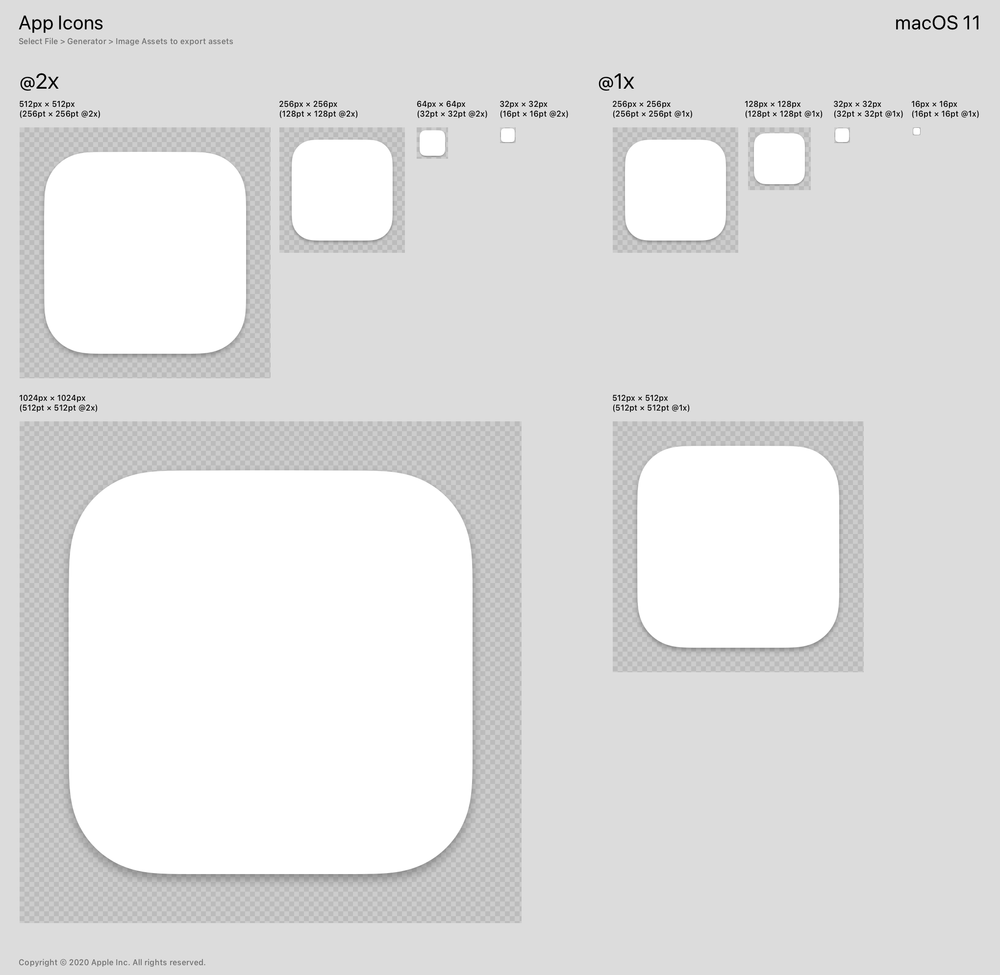

# macOS Compliant Icon Generator

**macOS Compliant Icon Generator** 是一个用于生成符合 Human Interface Guidelines (HIG)、App Icons and Images 和 Apple Design Resources 的图标生成器。该工具将根据规范将填满尺寸的图像转换为 13/16 的图片。

## 功能

该工具的主要功能是：
- 将输入的 1024x1024 尺寸的图像裁剪为 832x832 尺寸。
- 生成圆角矩形，其圆角半径为 832 的 22/100，或者换算为 (22/100) X (13/16) X 1024.
- 生成一个实际大小为 1024x1024，但其设计区域大小为 832x832 的图像。
- 生成用于 Xcode macOS 项目的其他小尺寸图标。

该工具的目标是简化图标生成过程，使其符合 Apple 的设计规范，从而在 macOS 上看起来更佳。

## App Icons



## 安装

```bash
git clone https://github.com/yc-w-cn/macos-compliant-icon-generator.git
cd macos-compliant-icon-generator
pnpm install
```

## 参考资料

[Why is my app icon bigger than the others in the macOS dock?](https://stackoverflow.com/questions/71118094/why-is-my-app-icon-bigger-than-the-others-in-the-macos-dock)